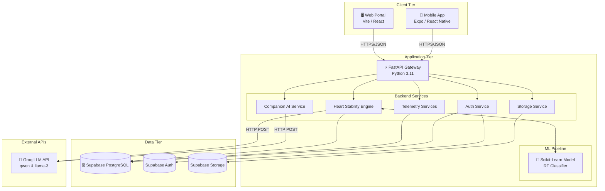

# HeartLink Mobile App 

## App Purpose
The application aims to monitor and track users' dietary and lifestyle habits and provide personalized recommendations, including food recipes and exercise routines, based on the user's Health Stability Score (HSS) to support cardiovascular health improvement.
HeartLink is designed to track and prevent heart disease from worsening, notice early warning signs, and remind users to get a timely in-person checkup from a nearby clinic.

> **Academic Capstone & Scope Note:**  
> HeartLink is an applied undergraduate Capstone Research Project (**Capstone 2 at Cebu Technological University - Main Campus / CTU Main**) developed with a scalable startup vision. The clinics listed in the app are part of a curated public directory to help users locate nearby healthcare facilities and encourage in-person medical checkups; HeartLink has no direct commercial affiliations with these clinics. Independent medical experts and faculty advisors assist the platform solely to audit and calibrate the safety and accuracy of recipes, exercises, and algorithmic scoring. HeartLink is a supportive wellness tool (not a diagnostic medical device) and encourages professional doctor consultations whenever warning indicators arise.

## 🏗️ System Architecture



### Components overview

* **Mobile App** (`HeartLink-mobile/`): Targets patients to monitor and track daily health metrics. Built with Expo / React Native.
* **Web Portal** (`HeartLink-web/`): Targets medical experts and administrators for case review and content management. Built with Vite / React.
* **Backend API** (`backend/`): Python 3.11 / FastAPI backend. Handles core business logic, secure JWT authentication, telemetry processing, and runs the scikit-learn Heart Stability Score (HSS) ML engine.
* **Database & Services**: Supabase (PostgreSQL, Auth, Storage) for the primary database. Integrates with the Groq LLM API (qwen/llama-3) to power the Companion AI and generate personalized health insights.

## 👥 User Roles & Access

| Role | Access Level | Primary Activities |
|------|--------------|--------------------|
| **Patient** | Mobile Application | Log vitals, meals, and exercise; view personalized Heart Stability Score (HSS) insights; talk to Companion AI; browse health resources. |
| **Medical Expert** | Web Portal | Audit content, evaluate algorithmic scoring accuracy, verify patient case records, and provide clinical safety feedback. |
| **System Admin** | Web Portal | User management, monitor system metrics, content configuration (recipes, exercises), and manage clinic directories. |

## 📁 Repository Structure

```plaintext
CAPSTONE-2/
├── backend/               # API server, data logic, ML engine, and external services
├── HeartLink-web/         # Administrative and evaluator web application
├── HeartLink-mobile/      # Cross-platform mobile client
├── landing/               # Standalone project landing page
└── documentation/         # Supplementary architecture diagrams, schemas, and specifications
```

## 🌐 Deployments & Environments

| Component | Provider / Platform | Environment | URL | Status |
|-----------|---------------------|-------------|-----|--------|
| **Backend API** | Railway | Production | `https://heartlink-api-production-46db.up.railway.app` | 🟢 Active |
| **Backend API (Standby)** | Render | Staging | `https://heartlink-staging.onrender.com` | 🟡 Suspended |
| **Web Portal** | Vercel | Production | `https://heartlink-admin-six.vercel.app` | 🟢 Active |
| **Database & Storage** | Supabase | Cloud Instance | `Protected Managed Service` | 🟢 Active |

## ⚙️ Prerequisites

Before running the application locally, ensure you have the following installed:

* **Python Runtime**: Version `Python 3.11`
* **Node.js Environment**: Version `Node.js v18+`
* **Package Managers**: `npm` (for web/mobile) and `pip` (for backend)
* **Client Tools**: `Expo Go` app (iOS/Android) or mobile emulators (Android Studio/Xcode)

## 🚀 Local Development Setup

To run the complete system locally, launch each service in its own terminal window:

### 1. Backend API (FastAPI)
```bash
cd backend
pip install -r requirements.txt
# Copy .env.example to .env and configure your Supabase keys
uvicorn app.main:app --reload
```
*Runs on http://localhost:8000*

### 2. Web Admin Portal (React/Vite)
```bash
cd HeartLink-web
npm install
# Copy .env.example to .env and configure VITE_API_URL
npm run dev
```
*Runs on http://localhost:5173*

### 3. Mobile App (React Native/Expo)
```bash
cd HeartLink-mobile
npm install
# Copy .env.example to .env and configure EXPO_PUBLIC_API_URL
npx expo start
```
*Scans the QR code with the Expo Go app on your physical device, or press 'a'/'i' to open in an emulator.*
