# HeartLink — System User Flows & Lifecycle Guide

This document outlines the step-by-step technical and user journeys for the primary features across the HeartLink mobile application and web portal.

## 1. Application Launch & Routing (Splash Screen)

The splash screen is the very first thing you see when you open the HeartLink app. It acts like a "traffic cop," checking who you are and directing you to the right place.

### Scenario
**"A patient opens the HeartLink app on their phone."**

When the patient taps the app icon, the app needs to quickly figure out:
1. Is this person already logged in?
2. If they are logged in, have they finished setting up their health profile?

Depending on the answers, the app decides whether to show them the login screen, the setup questionnaire, or their main dashboard.

### Logic Used
*   **Safety Net (Timeout):** The app gives the internet connection exactly 4 seconds to figure out who the user is. If the connection is too slow and takes longer than 4 seconds, the app will stop waiting and move forward. This ensures the user is never stuck on an endless loading screen.
*   **The 3 Paths (Routing):**
    1.  *Unauthenticated User:* If the app doesn't recognize the user (they aren't logged in), it sends them to the **Onboarding** screen to log in or create an account.
    2.  *New User:* If the user is logged in but hasn't finished answering their initial health questions, it sends them directly to the **Baseline Setup**.
    3.  *Returning User:* If the user is logged in and all setup is complete, they go straight to their **Dashboard**.

### 1.1 Technical Loading Flow
This diagram shows how the app juggles the logo animation and checking the user's memory at the same time:

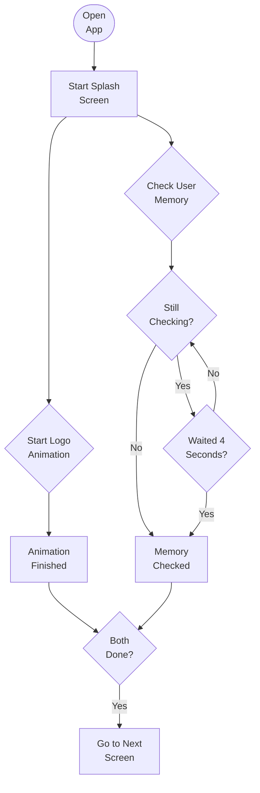

### 1.2 Routing Logic
This diagram shows how the app decides exactly where to send the user after the loading is done:

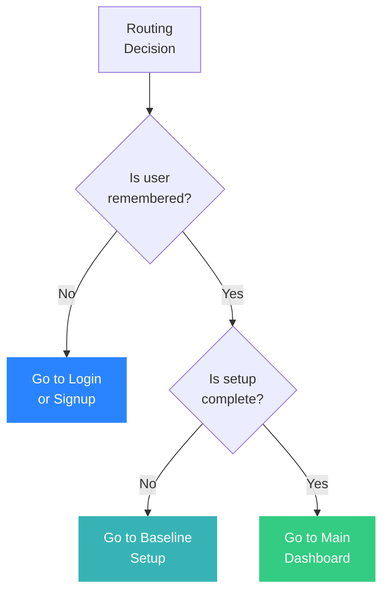

## 2. Account Registration & Login

This flow covers how a new patient creates an account and how returning patients log in.

### Scenario
**"A new patient wants to start using HeartLink, and a returning patient wants to check their dashboard."**

If it's a new patient, they need to provide their email, phone number, and a strong password. Because health data is highly sensitive, the app requires them to verify their phone number via a texted code (OTP) to prove it's really them.
If it's a returning patient, they simply log in using either their email or phone number and their password.

### Logic Used
*   **Smart Login Identifier:** The login screen is smart enough to accept *either* an email address or a phone number in the exact same box. It automatically detects which one the user typed.
*   **Password Security:** When creating an account, the app checks the password in real-time to make sure it has at least 8 characters, upper/lowercase letters, and a number.
*   **Verification (OTP):** To stop fake accounts, new users aren't immediately logged in. Instead, their details are held in a waiting state while a verification code is texted to them.
*   **Duplicate Checks:** If a user tries to register with an email or phone number that already belongs to an active account, the app will stop them and suggest they log in instead.

### 2.1 Registration Flow
This chart explains what happens behind the scenes when a user signs up:

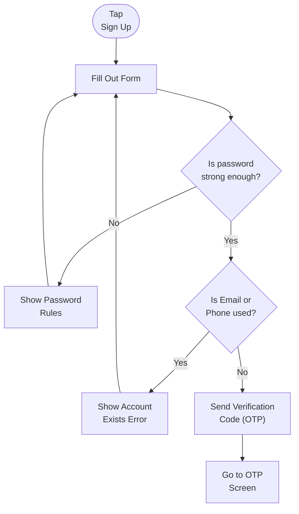

### 2.2 Login Flow
This chart explains how the app logs a returning user back in:

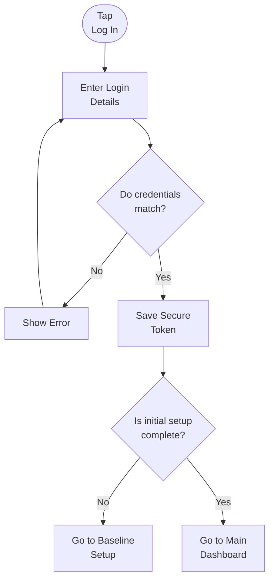

## 3. Baseline Setup Questionnaire

This flow describes what happens right after a new patient signs up. HeartLink requires baseline data to establish a personalized cardiovascular health model.

### Scenario
**"A new user completes their account registration and starts answering health questions."**

The user is taken through a 6-step questionnaire asking about their physical body, activity levels, sleep, smoking, alcohol, and diet. Once they finish, the app calculates their very first Health Stability Score (HSS).

### Logic Used
*   **Step-by-Step Collection:** The app groups questions into 6 distinct screens to avoid overwhelming the user (Biometrics -> Activity -> Sleep/Smoking -> Alcohol -> Diet -> Pre-existing Conditions).
*   **Context Memory:** Instead of saving data to the database after every single screen, the app holds all the answers securely in temporary memory.
*   **Final Calculation:** On the final "Calculating" screen, the app securely sends all the combined data to the server at once. The server immediately uses this data to calibrate the user's initial Health Stability Score (HSS).
*   **Status Update:** The user's account is permanently marked as "Onboarded" so they will never see these questions again, and they are sent to their Dashboard.

### 3.1 Setup Flow
This diagram shows the journey from the first question to the final dashboard reveal:

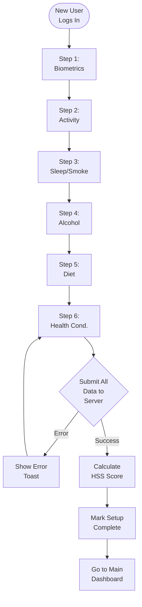
## 4. Main Dashboard Experience

The dashboard is the central hub of the HeartLink app. This is the main screen the patient interacts with every day to track their progress, view their score, log habits, and receive personalized advice.

### Scenario
**"A patient opens the app in the morning to check their status, log their blood pressure, and see what meals or exercises are recommended for them today."**

When the patient lands on the dashboard, they are greeted by an AI companion. They can instantly see their Health Stability Score (HSS) ring, a list of their 4 daily missions (Vitals, Meals, Movement, Sleep), personalized diet/exercise recommendations, their daily streak, and even a quick shortcut to find the nearest clinic. 
If the patient's score has dropped to a critical level overnight, an alert will instantly pop up suggesting they seek medical attention.

### Logic Used
*   **Offline Mode:** If the patient doesn't have internet, the dashboard still loads using their last known data. When they regain a connection, it silently syncs in the background without interrupting them.
*   **First-Time Tour:** If it's the patient's very first time, an interactive tutorial will guide them step-by-step through each section of the dashboard.
*   **Critical Alerts:** The app constantly checks for active health alerts. If one exists and hasn't been dismissed, it automatically shows a warning popup with a button to find the nearest clinic.
*   **Dynamic Companion:** The greeting message changes automatically based on the time of day, the patient's current daily streak, and their health score.
*   **Smart Routing:** The dashboard acts as a launchpad. Tapping a recipe recommendation opens the meal details, tapping the score ring opens an explanation of how the score is calculated, and tapping the map opens the facility locator.

### 4.1 Dashboard Loading Flow
This diagram shows what happens behind the scenes when the dashboard screen opens:

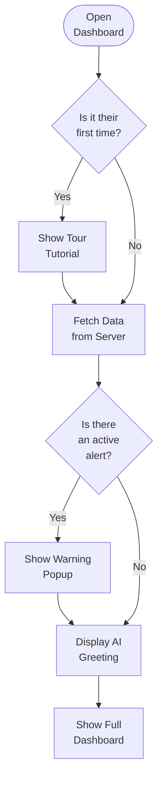

### 4.2 Comprehensive Dashboard Interactions
This diagram explains every major action a patient can take from the main dashboard screen:

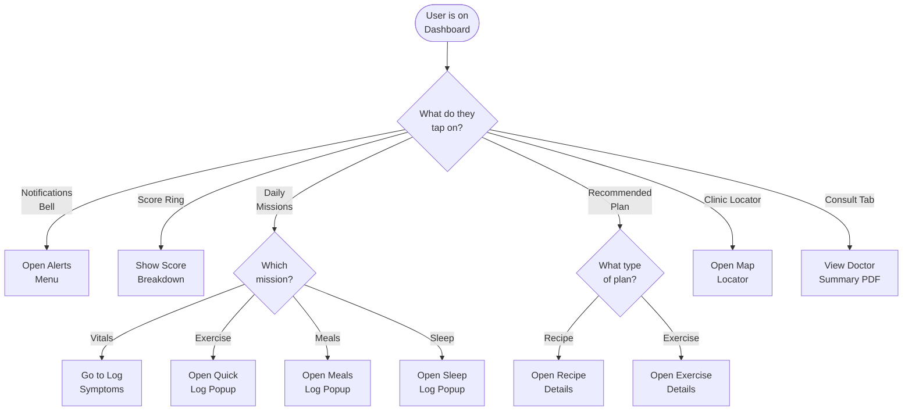

## 5. Daily Missions Tracking

Every day, the dashboard presents four daily missions to track the user's cardiovascular health: Vitals, Movement, Meals, and Sleep. 

### Scenario
**"A patient logs their daily habits directly from the dashboard."**

When the patient taps a mission, the app smartly determines the fastest way for them to log that specific type of data. Sleep pops up a quick slider, meals offer barcode scanning, and vitals open a detailed symptoms page.

### Logic Used
*   **Mission Status:** The dashboard instantly tells the user what's due (e.g. "Morning check due today") and updates to show progress (e.g. "120/80 mmHg" or "400 mg used") immediately after logging.
*   **Contextual Popups:** Instead of sending the user to separate screens for everything, Sleep and Movement can be logged via quick, frictionless popups without leaving the dashboard.
*   **Advanced Tracking:** For complex tasks like logging meals, a popup provides three powerful options: Scanning a barcode using the camera, searching the nutrition database, or estimating manually.

### 5.1 Vitals & Sleep Flow
This flowchart shows the straightforward path for tracking daily vitals and sleep habits:

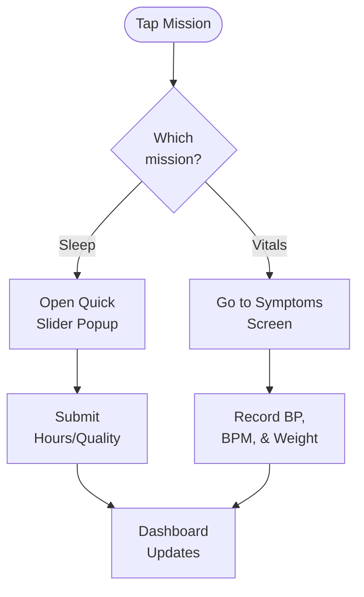

### 5.2 Meals & Movement Flow
Logging food and exercise has multiple options. Here is how the app handles them:

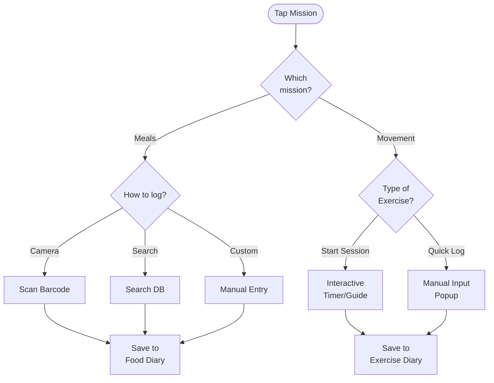

## 6. Trends & Analytics Experience

The Trends tab gives patients a comprehensive look at how their health is changing over time. It aggregates all the data they log into easy-to-read charts and summaries.

### Scenario
**"A patient wants to see if their blood pressure has improved over the last 14 days and wants to export a quick report to show their doctor."**

The patient navigates to the Trends tab. They tap "Blood Pressure" on the chart selector and change the timeframe to 14 days. The interactive graph updates instantly. They then tap the "Share" icon in the corner to generate a PDF report.

### Logic Used
*   **Dynamic Interactive Charts:** The app uses custom drawings to create smooth line charts. When the user switches tabs (e.g., from Heart Rate to Sodium), the chart automatically recalculates the curves and updates the graph.
*   **Averages & Highlights:** The app crunches the data to find the user's "Best Day" (highest HSS score) and their "Highest Sodium" day, displaying them in a quick summary section alongside progress bars for their sleep, activity, and sodium goals.
*   **PDF Generation:** The export feature doesn't just take a screenshot. It builds a structured document in the background with the user's latest stats, converts it to a PDF, and triggers the native phone sharing menu (Messages, Email, Print).

### 6.1 Trends Screen Flow
This flowchart shows how the patient navigates and interacts with their data on the Trends screen:

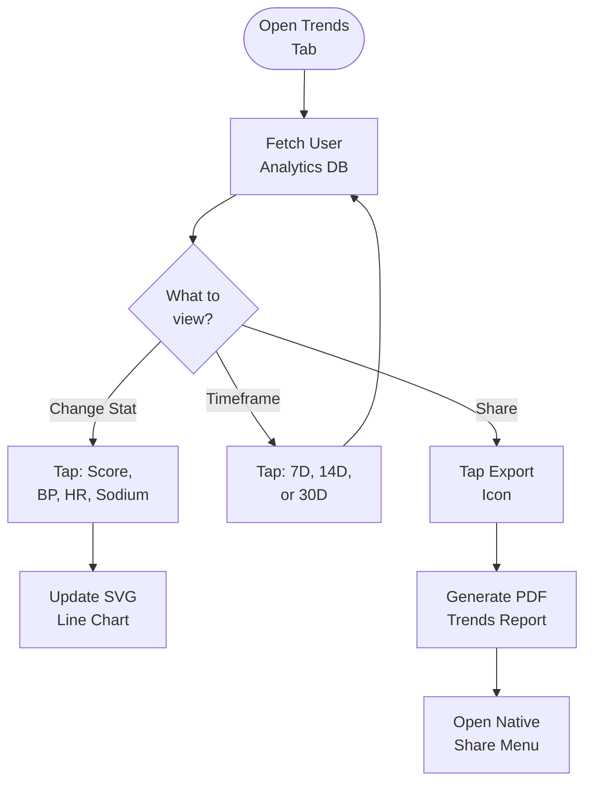

## 7. Explore & Discovery Experience

The Explore tab serves as the patient's discovery engine. This is where they can find new heart-healthy recipes, discover recommended exercise routines, and access their saved favorites.

### Scenario
**"A patient is looking for a new cardio workout or a low-sodium dinner recipe."**

The patient opens the Explore tab and uses the search bar at the top to type what they want (e.g., "salad"). The app instantly highlights matching results. They can use the "Recipes" or "Exercise" pills to filter down their choices, or look at their "Saved" list for meals they've bookmarked before.

### Logic Used
*   **Live Search Highlighting:** As the user types into the search bar, the app instantly filters the list and visually highlights the matching letters in the search results so they know exactly why a result appeared.
*   **Smart Categorization:** The main "All" view shows a curated mix of the top 5 recipes and top 3 exercises recommended for them today.
*   **Category Filtering:** Tapping the pills (All, Recipes, Exercise, Saved) dynamically switches the entire layout of the screen. Recipes are displayed in a visually heavy grid format, while exercises are shown in a clean list format.

### 7.1 Explore Tab Flow
This flowchart maps out how the discovery engine works:

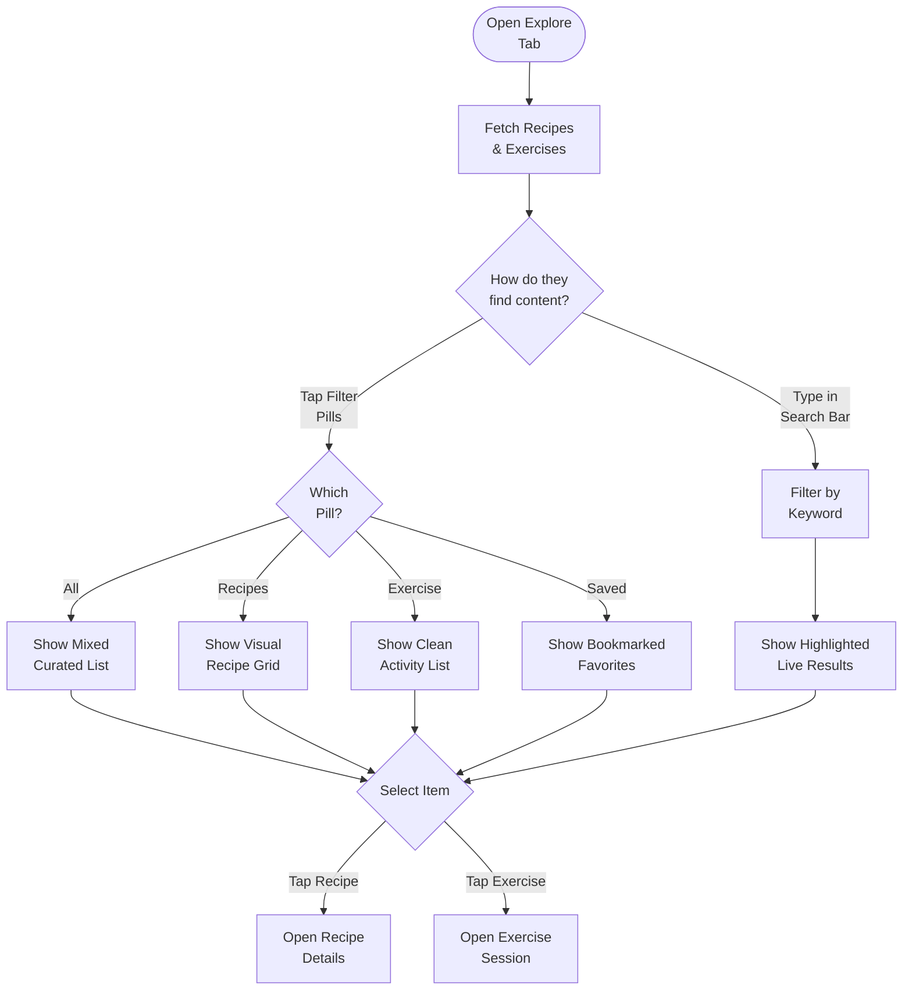

## 8. Recipe Details & Food Logging Flow

When a user taps on a recipe from the Explore tab or the Dashboard, they are brought to the Recipe Details screen. This page acts as both a cookbook and a nutrition calculator.

### Scenario
**"A patient finds a recipe, adjusts the portion size because they are cooking for two, and then logs the meal to their daily diary."**

The patient opens a recipe and sees the ingredients list and step-by-step instructions. They use the '+' button to increase the servings. The app instantly updates the nutrition macros. Because they doubled the portion, a warning pops up letting them know this new portion size exceeds their recommended sodium limit. They adjust it back down and tap "Log This Meal".

### Logic Used
*   **Dynamic Servings:** The app multiplies the calories, sodium, fiber, and saturated fat in real-time as the user adjusts the servings counter.
*   **Safety Limits:** The app constantly checks the current sodium value against a hard limit (140mg per meal). If exceeded, a red warning alert appears to stop the patient from consuming too much sodium in one sitting.
*   **Offline Meal Logging:** If the user is in the kitchen with bad internet and logs the meal, the app smartly saves it locally ("queued for sync") and uploads it later when a connection is restored.
*   **Heart Verification:** Recipes that have been professionally verified display a badge noting they are approved by a clinical nutritionist.

### 8.1 Recipe Interaction Flow
This flowchart maps out how a user interacts with a recipe and ultimately logs it:

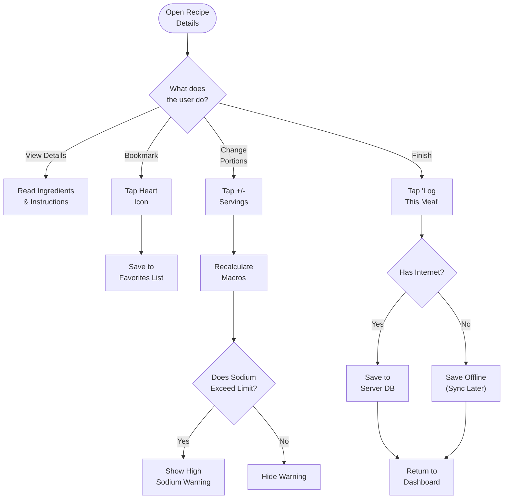

## 9. Exercise Session Flow

The HeartLink app doesn't just list workouts; it actively guides patients through them while prioritizing cardiac safety. This flow covers everything from viewing the workout instructions to the live timer and the post-workout safety checks.

### Scenario
**"A patient decides to start a 15-minute cardio routine but feels slight chest tightness halfway through and stops."**

The patient opens the Cardio workout and reads the guide. They tap "Start Exercise" and a 3-second countdown begins. The live session timer starts. Halfway through, they tap the 'X' button because they feel unwell. The app immediately asks if they stopped because they were tired or because of symptoms. They select symptoms, and the app instantly aborts the workout and rushes them to the Symptom Logger to record the chest tightness.

### Logic Used
*   **Safety First (Critical Lock):** Before a workout even starts, the app checks the user's Health Stability Score (HSS). If it's critically low, or if they recently logged a severe symptom, the "Start" button is locked to prevent cardiac strain.
*   **Adaptive Player:** The live workout player adapts to the type of exercise. It loads a specialized screen depending on whether it's Breathing, Stretching, Cardio, or General Activity.
*   **Short Session Check:** If the user stops a workout in under 30 seconds, the app asks if they want to discard it or save it anyway, preventing accidental logs.
*   **Clinical Safety Net:** Every time a user finishes or stops an exercise, they must answer a post-workout assessment ("I feel OK" vs. "I have symptoms"). Logging symptoms here automatically tags them as exercise-induced for their doctor to review.

### 9.1 Exercise Session State Machine
This flowchart details the exact sequence of states a patient moves through during an active exercise session, including all safety exits:

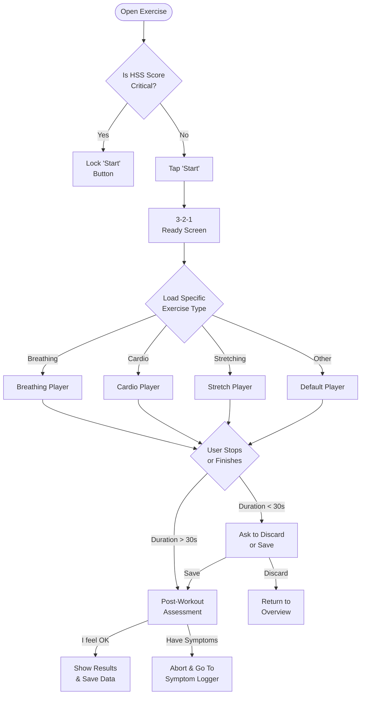

## 10. Symptom & Vitals Logger (Daily Check-in)

The daily check-in is the core data collection tool of HeartLink. It captures blood pressure, heart rate, weight, medication adherence, and any acute symptoms. 

### Scenario
**"A patient wakes up, takes their blood pressure, and logs it into the app."**

The patient taps the '+' button to log their vitals. They enter their systolic (top) and diastolic (bottom) numbers, their pulse, and select that they took their meds. They use the slider to record mild fatigue (Level 3). The app validates that the top number is higher than the bottom number and saves the log.

### Logic Used
*   **Medical Validation:** The app performs sanity checks on the inputs: Systolic must be higher than Diastolic by at least 15 points. Weight cannot be absurdly low or high. If values are backwards, it throws an error.
*   **Emergency Triggers:** The app constantly evaluates the vitals. If it detects an acute Hypertensive Crisis (>=180/120) or Severe Hypotension (<90/60), it immediately displays a full-screen red emergency modal advising them to seek medical care.
*   **Interactive Severity Slider:** When a symptom is selected, an interactive draggable slider appears to rate the pain/severity from 1 to 10, changing color from green to red.

### 10.1 Symptom Logger Flow

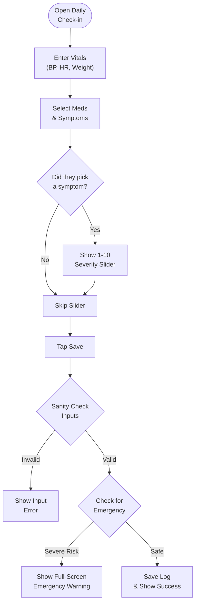

## 11. Barcode Food Scanner Flow

To make logging sodium and calories easier, patients can simply scan the barcode on any packaged food using their phone's camera.

### Scenario
**"A patient is at the grocery store and wants to check the sodium content of a soup can before buying it."**

The patient taps "Scan meal". The camera opens with a laser animation. They center the barcode. The app instantly looks up the item from a global database and returns the nutrition facts, automatically highlighting the sodium amount.

### Logic Used
*   **Global Database Lookup:** Scanned barcodes are instantly sent to the OpenFoodFacts API (`world.openfoodfacts.org`).
*   **Serving Size Normalization:** The app smartly parses the API response to find the "per serving" metrics. If "per serving" isn't available, it defaults to calculating the macros based on 100g and labels it appropriately.
*   **Fallback Mechanism:** If the scanner fails, times out, or the barcode is unlisted, an alert pops up offering the patient to "Estimate" the meal manually or try typing the barcode numbers themselves.

### 11.1 Barcode Scanner Flow

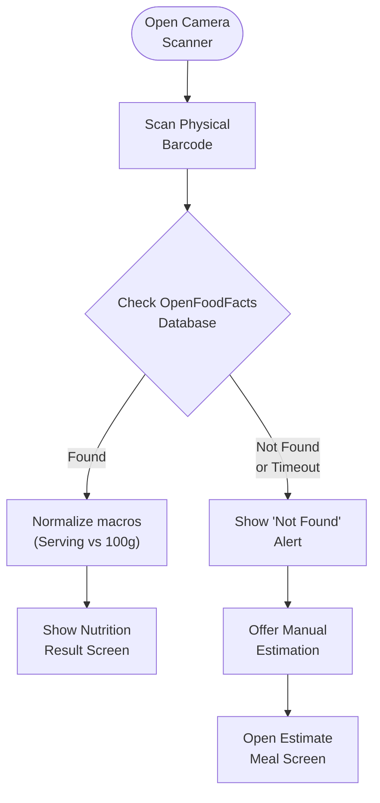

## 12. Clinic & Emergency Locator Flow

The app features a built-in locator to help patients quickly find cardiovascular centers and emergency rooms near them.

### Scenario
**"A patient feels severe palpitations while traveling in a new city and needs to find the nearest cardiologist."**

The patient opens the "Emergency locator" screen. The app pulls their GPS location and displays a list of nearby clinics, sorted exactly by how close they are. Emergency hospitals are badged "24/7", while regular clinics show if they are currently open. The patient taps "Directions" on the nearest one.

### Logic Used
*   **Haversine Distance Calculation:** The app pulls the user's live coordinates (latitude/longitude) and mathematically calculates the exact distance (in km) to every clinic in the database.
*   **Smart Sorting & Status:** Clinics are dynamically sorted from closest to farthest. The app checks the current local time against the clinic's operating hours to label it "Open now" or "Closed" (ignoring 24/7 emergency rooms).
*   **Native OS Linking:** Tapping "Directions" sends a specialized link (`http://maps.apple.com/` for iOS, `google.navigation:` for Android) that instantly opens the phone's native map app with the route pre-loaded. Tapping "Call" opens the native phone dialer.

### 12.1 Clinic Locator Flow

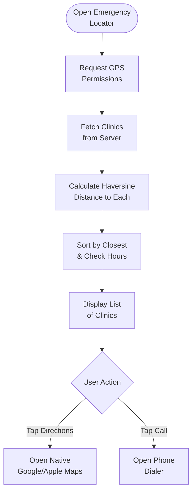

## 13. Expert Consultation Summary Flow

This screen is a "print-ready" view designed specifically to be handed to a cardiologist during a routine check-up.

### Scenario
**"A patient is sitting in the waiting room at their cardiologist's office. The nurse asks for their latest vitals."**

The patient opens the Consultation Summary tab. They see a clean, professional dashboard summarizing their last 7 days of averages, their highest risks, and a timeline of their symptoms. They tap "Share PDF" and AirDrop/Email the report directly to the nurse's tablet.

### Logic Used
*   **Data Aggregation:** The page heavily relies on React Query to pull massive amounts of data (analytics, history, missions) and calculates 7-day averages for BP, HR, and Sodium. 
*   **Insight Generation:** It scans the logs to generate quick insights like "Reported Shortness of Breath 2 times this week".
*   **PDF Printing:** Utilizing `expo-print`, the app constructs a hidden, beautifully formatted HTML document containing all the medical data and graphs, converts it to a PDF file, and uses `expo-sharing` to open the phone's share sheet.

### 13.1 Consultation Summary Flow

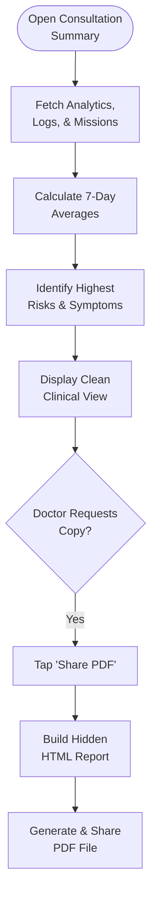
